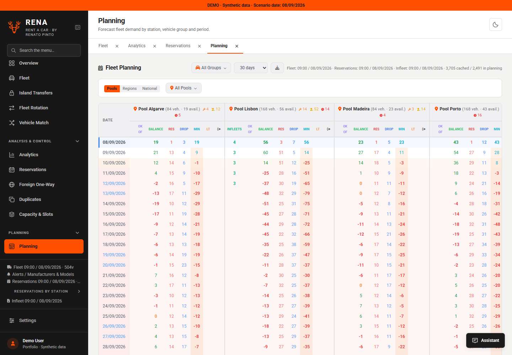
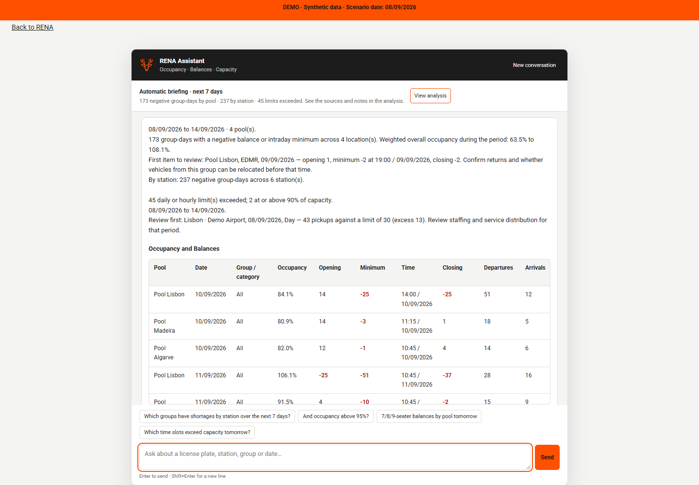

<p align="center"></p>

# RENA — Rent a Car

**Fleet visibility, rental planning and operational decision support.**

Built by **[Renato Pinto · @quebranozes](https://github.com/quebranozes)**.

RENA brings fleet availability, reservations, vehicle allocation, station capacity and transport planning into one workspace. This public portfolio edition uses **synthetic data**, an **English interface** and a **local, deterministic operational assistant**.

**Use and adaptations:** Explore and modify RENA to suit your needs. Own use is free. Any rent-a-car company must contact **Renato Pinto before applying the project in its business**, and anyone making an adaptation must inform him of the changes. [Send a usage or adaptation notice](https://github.com/quebranozes/rena-rent-a-car/issues/new?template=usage-notification.md). See the [license and previous MIT release note](#author--license) below.



## Why I built it

Car-rental operations involve connected decisions: whether stations can fulfill upcoming pickups, which vehicle groups are running short, whether service capacity can handle demand, and which vehicles can be repositioned. I developed RENA to bring these questions together in a practical operations workspace.

This standalone demonstration is adapted from my professional project. It contains fictional records and illustrative station locations, has no connection to an employer's systems, and is not an official product of any rental company.

## Explore the workspace

| Area | Capabilities |
| --- | --- |
| **Overview & analytics** | Fleet status, availability, workshop vehicles, holds, powertrains and upcoming contract returns. |
| **Fleet explorer** | Search license plates and filter vehicles by group, location, status and ownership type. |
| **Reservations** | Filter pickups and returns by date, station and group; export to CSV or Excel. |
| **Planning** | Compare opening balances, departures, returns, intraday minimums and projected occupancy by station, pool or region. |
| **Capacity & slots** | Compare pickup workload with daily and hourly limits; highlight approaching and exceeded capacity. |
| **Vehicle Match** | Find suitable reservations using group compatibility, location, availability and contract constraints. |
| **Duplicate review** | Identify overlapping reservations for review and export the results. |
| **Island transfers** | Find eligible vehicles by location, group, ownership and remaining contract days. |
| **Fleet rotation** | Browse transport loads, routes, vehicles and lifecycle statuses. |
| **Foreign one-way** | Inspect international one-way reservations and foreign-registered vehicles. |
| **Local assistant** | Ask operational questions and receive calculated answers, tables, timestamps and explanatory notes. |

The scenario contains **504 vehicles, 3,705 reservations, 12 transport loads, 6 stations and 12 vehicle groups**. Dates move with the current day in the Lisbon timezone while preserving relative timing.

## Run locally

Requires **Python 3.12 or newer**. Internet access is needed to install dependencies the first time.

```sh
git clone https://github.com/quebranozes/rena-rent-a-car.git
cd rena-rent-a-car
python -m venv .venv
```

Activate the environment:

```powershell
# Windows PowerShell
.venv\Scripts\Activate.ps1
```

```sh
# macOS / Linux
source .venv/bin/activate
```

Install and start:

```sh
python -m pip install -r requirements.txt
python server.py
```

Open **[localhost:5051](http://127.0.0.1:5051)**. The server opens your browser automatically. On Windows, you can also double-click **start_demo.bat**.

```sh
# Optional: a different port without opening a browser
python server.py --port 5052 --no-browser

# Automated checks
python -m unittest discover -s tests -p "test_*.py"
```

Stop with `Ctrl+C`. Visual assets are bundled locally; no external AI service, API key or account is required. GitHub hosts the source code; the Python application runs locally and cannot run on GitHub Pages alone.

## A five-minute walkthrough

1. Open **Overview** to inspect fleet health and the illustrative station map.
2. Search **ZZ-01-DA** in **Fleet** or **Vehicle Match**.
3. Open **Planning**, compare pools and inspect a negative balance or intraday minimum.
4. Open **Capacity & Slots** to compare available vehicles with pickup workload.
5. Ask the assistant a question below, then try **“And tomorrow?”**.

```text
Analyze planning and capacity for the next 7 days
Which Luxury groups have shortages by pool over the next 7 days?
Occupancy by station above 90% tomorrow
LCV balances and occupancy by pool tomorrow
Which time slots exceed capacity tomorrow?
Which potential duplicate reservations do we have?
Find reservations for ZZ-01-DA
```



The assistant uses a supported vocabulary and deterministic calculations. It is not a general-purpose LLM. English questions and the original Portuguese query vocabulary are supported; responses are in English. Unsupported filters return guidance instead of fabricated results.

## Engineering choices

- **Python + Flask** for the server and calculation APIs; **vanilla JavaScript** for the interface.
- **Shared calculations** keep assistant answers aligned with planning and capacity views.
- **Intraday event ordering** processes departures before arrivals at the same time to expose temporary shortages.
- **Weighted occupancy** uses fleet denominators instead of averaging station percentages.
- **Reproducible synthetic scenarios** support demos and regression checks without operational records.
- **Read-only behavior** rejects record changes; browser simulations are temporary.
- **Local assets** include charts, map rendering, fonts and icons, with their license notices preserved.

See [Architecture](docs/ARCHITECTURE.md), [Validation](docs/VALIDATION.md) and [Third-party notices](THIRD_PARTY.md).

```text
server.py                   Local server and demo API
calculations.py             Fleet, reservation and allocation calculations
rena_planning.py            Planning and capacity diagnostics
rena_assistant.py           Deterministic operational queries
rena_language.py            English query vocabulary normalization
demo_clock.py               Synthetic scenario date shifting
data/                      Synthetic snapshot and configuration
static/                    English UI and local visual assets
tools/generate_examples.py  Synthetic scenario generator
tests/                     API, data-isolation and language checks
```

## Scope and contributions

This is a local portfolio demo. It uses a demo identity, binds to the loopback interface and intentionally rejects persistent record changes. Production use would require authentication, authorization, persistence and a deployment design. The map is illustrative and does not calculate road routes. Forecast assumptions are explained in the application.

Contributions are welcome: broader English query coverage, dedicated domain modules, more planning scenarios, accessibility improvements and regression tests. See [Contributing](CONTRIBUTING.md).

## Author & license

**Renato Pinto — [@quebranozes](https://github.com/quebranozes)**  
Project author and maintainer.

From **v1.1.0**, new original material is offered under the **[RENA Own Use and Adaptation Notice License 1.0](LICENSE)**, a custom source-available license:

- **Free own use:** learning, exploration, evaluation and your own personal or internal use.
- **Modifications welcome:** inform Renato of any adaptation and its intended use. An issue or pull request describing it counts as notification; source disclosure and waiting for approval are not required.
- **Rent-a-car companies:** contact Renato before operational use, including unmodified deployments and deployments by a contractor. Own internal use remains free under these terms.
- **Attribution:** preserve the author's credit and license when sharing copies or adaptations. Free sharing and public forks are allowed under these terms; selling the software or offering it as a paid service requires separate terms.

Use the [usage and adaptation notice](https://github.com/quebranozes/rena-rent-a-car/issues/new?template=usage-notification.md) to contact the author. Development and support services, if requested, are agreed separately.

**Licensing history:** [v1.0.0](https://github.com/quebranozes/rena-rent-a-car/tree/v1.0.0) was released under [MIT](docs/licenses/MIT-v1.0.0.txt). Those existing permissions remain in place, including for unchanged material carried into this release; the new conditions cannot retroactively restrict that MIT grant. Third-party resources retain their respective terms in [THIRD_PARTY.md](THIRD_PARTY.md).
