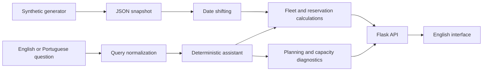

# Architecture

RENA is a local Flask application serving a JavaScript interface and JSON calculation APIs.

## Data and calculations

`tools/generate_examples.py` produces fleet records, reservations, stations, limits and transport loads from a fixed random seed. It reads no operational files. `server.py` shifts the snapshot's dates in memory relative to the current day in `Europe/Lisbon`; the stored snapshot remains unchanged.

`calculation_setup.py` provides Flask configuration and in-memory adapters. `calculations.py` implements planning, reservations, exports, matching, capacity and rotation.

Intraday minima process departures before arrivals at the same time. Long-term, fleet-exit and over-mileage returns do not restore availability. Occupancy aggregates counts and denominators rather than averaging percentages. Future workshop and hold assumptions remain constant. Browser simulations are excluded from the assistant's baseline.

Capacity measures pickup workload, separately from fleet utilization. A station can have vehicles available and still exceed a service limit.

## Assistant

`rena_language.py` normalizes supported English vocabulary for the deterministic parser. `rena_assistant.py` extracts intent, locations, groups, dates and filters. `rena_planning.py` calculates diagnostics from the same data as the interface. Replies contain calculated values, tables and source notes.

Conversation context stores filters and is signed with a process-specific random secret. It expires after one hour. The assistant does not contact an LLM or external API.

## Local boundaries

The server binds to `127.0.0.1`. Most write requests are rejected; assistant queries and harmless preview/reset endpoints are exceptions. Static files come only from `static/`. The content security policy restricts browser connections to the local origin.

The demo identity and inline script requirements are intended for local demonstration. Production hosting requires a separate authentication, persistence and security design.

Public text, sample labels, assistant answers and export headings are English. Internal field names and Portuguese query vocabulary remain compatible. Dates use day/month/year and 24-hour time with a Lisbon timezone reference. Python 3.12+ is required.
